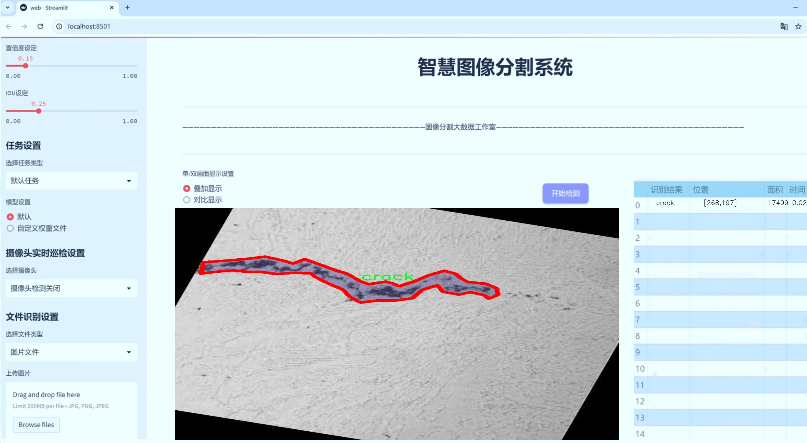
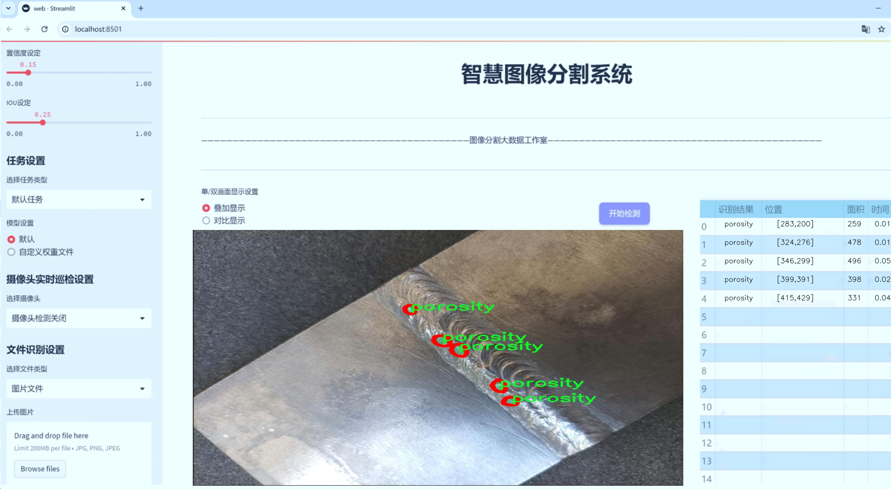
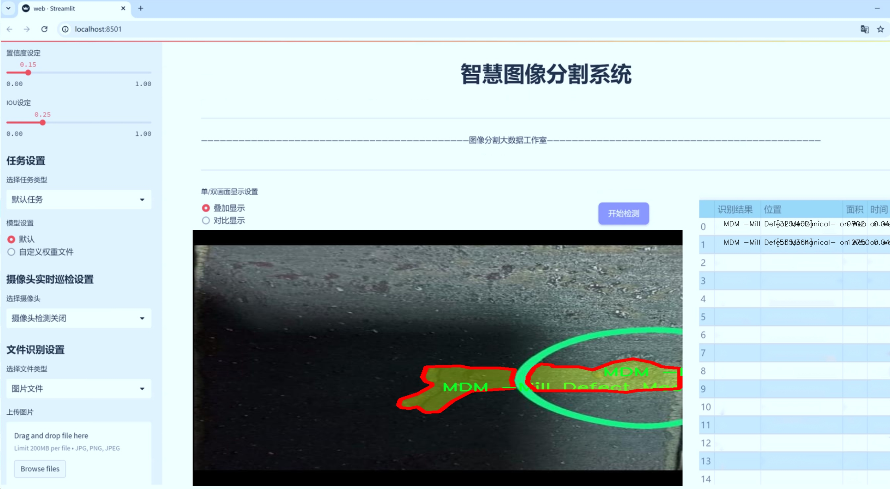
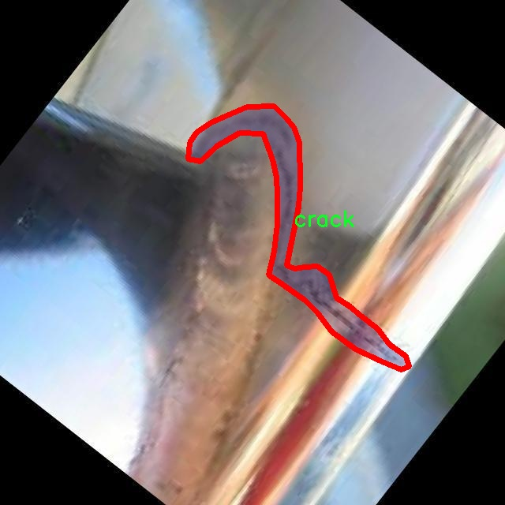
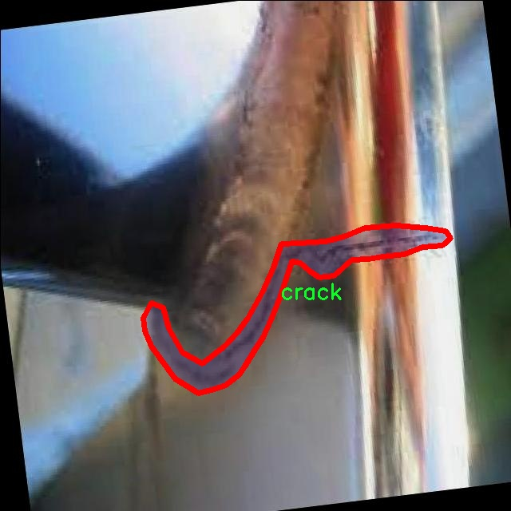
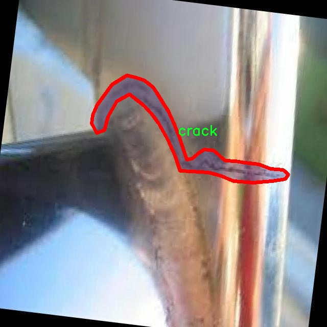
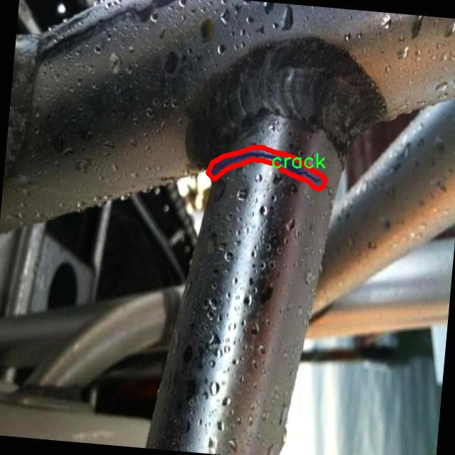
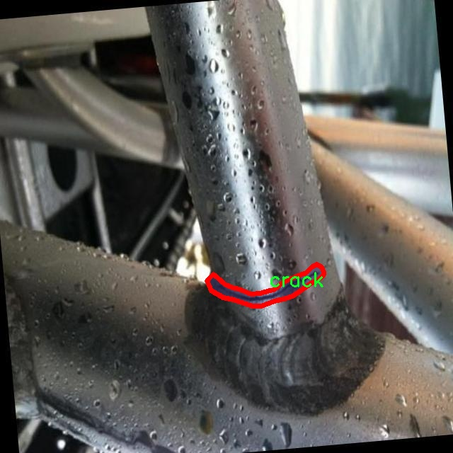

# 金属缺陷分割系统源码＆数据集分享
 [yolov8-seg-efficientViT＆yolov8-seg-C2f-Parc等50+全套改进创新点发刊_一键训练教程_Web前端展示]

### 1.研究背景与意义

项目参考[ILSVRC ImageNet Large Scale Visual Recognition Challenge](https://gitee.com/YOLOv8_YOLOv11_Segmentation_Studio/projects)

项目来源[AAAI Global Al lnnovation Contest](https://kdocs.cn/l/cszuIiCKVNis)

研究背景与意义

在现代制造业中，金属材料的质量直接影响到产品的性能和安全性。随着工业自动化和智能制造的快速发展，金属缺陷检测的需求日益增加。传统的金属缺陷检测方法往往依赖于人工目视检查或简单的机器检测，这不仅效率低下，而且容易受到人为因素的影响，导致漏检或误检。因此，开发一种高效、准确的金属缺陷检测系统显得尤为重要。近年来，深度学习技术的迅猛发展为图像处理和目标检测领域带来了新的机遇，尤其是基于卷积神经网络（CNN）的实例分割算法，如YOLO（You Only Look Once）系列，因其高效性和准确性而受到广泛关注。

YOLOv8作为YOLO系列的最新版本，结合了多种先进的技术，具有更强的特征提取能力和更快的推理速度，能够在复杂的工业环境中实时检测和分割金属缺陷。然而，现有的YOLOv8模型在特定应用场景下仍存在一定的局限性，尤其是在金属缺陷的多样性和复杂性方面。因此，基于改进YOLOv8的金属缺陷分割系统的研究具有重要的现实意义。

本研究将使用一个包含1100张图像和20类金属缺陷的综合数据集“merged_metal_defect”，该数据集涵盖了多种金属缺陷类型，如“Bump Mark”、“Fire Crack”、“Heavy wear out”等，反映了金属材料在实际生产过程中可能出现的各种缺陷。这些缺陷不仅影响产品的外观，还可能对其结构完整性和使用寿命造成严重影响。因此，准确识别和分割这些缺陷，对于提高金属材料的质量控制水平，降低生产成本，保障产品安全具有重要意义。

通过对YOLOv8模型的改进，本研究旨在提升金属缺陷的检测精度和分割效果。具体而言，我们将针对数据集中不同缺陷的特征，优化模型的网络结构和训练策略，以提高其对复杂背景和小目标的适应能力。此外，研究还将探讨数据增强、迁移学习等技术在金属缺陷检测中的应用，以进一步提升模型的泛化能力和鲁棒性。

综上所述，基于改进YOLOv8的金属缺陷分割系统的研究，不仅能够推动深度学习技术在工业检测领域的应用，还将为金属材料的质量控制提供新的解决方案。这一研究不仅具有理论价值，也具有广泛的应用前景，将为制造业的智能化转型提供有力支持。通过实现高效、准确的金属缺陷检测，能够显著提升生产效率，降低企业的运营风险，最终实现更高水平的产品质量和安全保障。

### 2.图片演示







##### 注意：由于此博客编辑较早，上面“2.图片演示”和“3.视频演示”展示的系统图片或者视频可能为老版本，新版本在老版本的基础上升级如下：（实际效果以升级的新版本为准）

  （1）适配了YOLOV8的“目标检测”模型和“实例分割”模型，通过加载相应的权重（.pt）文件即可自适应加载模型。

  （2）支持“图片识别”、“视频识别”、“摄像头实时识别”三种识别模式。

  （3）支持“图片识别”、“视频识别”、“摄像头实时识别”三种识别结果保存导出，解决手动导出（容易卡顿出现爆内存）存在的问题，识别完自动保存结果并导出到tempDir中。

  （4）支持Web前端系统中的标题、背景图等自定义修改，后面提供修改教程。

  另外本项目提供训练的数据集和训练教程,暂不提供权重文件（best.pt）,需要您按照教程进行训练后实现图片演示和Web前端界面演示的效果。

### 3.视频演示

[3.1 视频演示](https://www.bilibili.com/video/BV1Bh2SYZEbr/)

### 4.数据集信息展示

##### 4.1 本项目数据集详细数据（类别数＆类别名）

nc: 19
names: ['Bump Mark 2-3 steps', 'Fire Crack', 'Flange wavy', 'GM-Guide Mark-', 'Heavy wear out on both top flange', 'Heavy wear out', 'LC -Longitudinal Crack-', 'LNF -Lock not Found- on South flange in Sheet Pile', 'Lap - Sliver on north top Junction', 'Lap on South top flange tip', 'Lap on south outer flange heavy section', 'Lap', 'MDM -Mill Defect Mechanical- on Web on web', 'RPB -Roll Burr Pit- on Web', 'Step in flange', 'Twist in CR-80 Rail', 'Web wavy', 'crack', 'porosity']


##### 4.2 本项目数据集信息介绍

数据集信息展示

在本研究中，我们采用了名为“merged_metal_defect”的数据集，以训练和改进YOLOv8-seg模型，旨在实现高效的金属缺陷分割系统。该数据集专注于金属材料中的各种缺陷，涵盖了19个不同的类别，每个类别代表了一种特定的缺陷类型。这些缺陷的识别与分割对于金属加工和制造行业至关重要，因为它们直接影响到产品的质量和安全性。

数据集中包含的类别包括“Bump Mark 2-3 steps”、“Fire Crack”、“Flange wavy”、“GM-Guide Mark-”、“Heavy wear out on both top flange”、“Heavy wear out”、“LC -Longitudinal Crack-”、“LNF -Lock not Found- on South flange in Sheet Pile”、“Lap - Sliver on north top Junction”、“Lap on South top flange tip”、“Lap on south outer flange heavy section”、“Lap”、“MDM -Mill Defect Mechanical- on Web on web”、“RPB -Roll Burr Pit- on Web”、“Step in flange”、“Twist in CR-80 Rail”、“Web wavy”、“crack”和“porosity”。这些类别的多样性反映了金属材料在生产和使用过程中可能遭遇的各种缺陷类型，涵盖了从表面缺陷到结构性缺陷的广泛范围。

数据集的构建过程经过精心设计，确保了样本的多样性和代表性。每个类别的样本数量均衡，以避免模型在训练过程中对某些类别的偏向。此外，数据集中的图像均经过专业标注，确保每个缺陷的边界清晰可辨。这种高质量的标注为YOLOv8-seg模型的训练提供了坚实的基础，使其能够在实际应用中实现高精度的缺陷检测和分割。

在数据预处理阶段，我们对图像进行了标准化处理，以提高模型的训练效率和效果。图像的尺寸被统一调整，以适应YOLOv8-seg模型的输入要求。同时，为了增强模型的鲁棒性，我们还采用了数据增强技术，包括随机裁剪、旋转、翻转等操作，以生成更多的训练样本。这些技术的应用不仅丰富了数据集的多样性，还有效提升了模型在面对不同环境和条件下的适应能力。

通过对“merged_metal_defect”数据集的深入分析和应用，我们期望能够显著提升YOLOv8-seg模型在金属缺陷分割任务中的表现。该数据集不仅为模型的训练提供了丰富的样本，还为后续的模型评估和优化奠定了基础。我们相信，借助这一高质量的数据集，所构建的金属缺陷分割系统将能够在实际工业应用中发挥重要作用，帮助企业提高生产效率，降低缺陷率，从而提升产品的整体质量和市场竞争力。











### 5.全套项目环境部署视频教程（零基础手把手教学）

[5.1 环境部署教程链接（零基础手把手教学）](https://www.bilibili.com/video/BV1jG4Ve4E9t/?vd_source=bc9aec86d164b67a7004b996143742dc)


[5.2 安装Python虚拟环境创建和依赖库安装视频教程链接（零基础手把手教学）](https://www.bilibili.com/video/BV1nA4VeYEze/?vd_source=bc9aec86d164b67a7004b996143742dc)

### 6.手把手YOLOV8-seg训练视频教程（零基础小白有手就能学会）

[6.1 手把手YOLOV8-seg训练视频教程（零基础小白有手就能学会）](https://www.bilibili.com/video/BV1cA4VeYETe/?vd_source=bc9aec86d164b67a7004b996143742dc)


按照上面的训练视频教程链接加载项目提供的数据集，运行train.py即可开始训练



     Epoch   gpu_mem       box       obj       cls    labels  img_size
     1/200     0G   0.01576   0.01955  0.007536        22      1280: 100%|██████████| 849/849 [14:42<00:00,  1.04s/it]
               Class     Images     Labels          P          R     mAP@.5 mAP@.5:.95: 100%|██████████| 213/213 [01:14<00:00,  2.87it/s]
                 all       3395      17314      0.994      0.957      0.0957      0.0843

     Epoch   gpu_mem       box       obj       cls    labels  img_size
     2/200     0G   0.01578   0.01923  0.007006        22      1280: 100%|██████████| 849/849 [14:44<00:00,  1.04s/it]
               Class     Images     Labels          P          R     mAP@.5 mAP@.5:.95: 100%|██████████| 213/213 [01:12<00:00,  2.95it/s]
                 all       3395      17314      0.996      0.956      0.0957      0.0845

     Epoch   gpu_mem       box       obj       cls    labels  img_size
     3/200     0G   0.01561    0.0191  0.006895        27      1280: 100%|██████████| 849/849 [10:56<00:00,  1.29it/s]
               Class     Images     Labels          P          R     mAP@.5 mAP@.5:.95: 100%|███████   | 187/213 [00:52<00:00,  4.04it/s]
                 all       3395      17314      0.996      0.957      0.0957      0.0845


### 7.50+种全套YOLOV8-seg创新点代码加载调参视频教程（一键加载写好的改进模型的配置文件）

[7.1 50+种全套YOLOV8-seg创新点代码加载调参视频教程（一键加载写好的改进模型的配置文件）](https://www.bilibili.com/video/BV1Hw4VePEXv/?vd_source=bc9aec86d164b67a7004b996143742dc)

### 8.YOLOV8-seg图像分割算法原理

原始YOLOv8-seg算法原理

YOLOv8-seg算法是Ultralytics公司在2023年推出的最新版本，它在YOLO系列的基础上进行了深度优化，尤其是在目标检测和图像分割任务中表现出色。YOLOv8-seg不仅继承了YOLO系列算法的高效性和准确性，还引入了一些新的设计理念和技术，旨在提高模型的灵活性和实用性。

首先，YOLOv8-seg的输入处理方式具有显著的创新。默认情况下，输入图像的尺寸为640x640，但在实际应用中，图像的长宽比往往不一致。为了解决这一问题，YOLOv8-seg采用了自适应图片缩放的策略。在测试或推理阶段，算法会将图像的长边按比例缩小到指定尺寸，然后对短边进行填充。这种方法有效减少了填充区域，降低了信息冗余，从而提升了目标检测的速度和准确性。此外，在模型训练过程中，YOLOv8-seg引入了Mosaic图像增强技术。该技术通过随机选择四张图像，进行缩放和拼接，生成新的训练样本。这种方法不仅增加了训练样本的多样性，还促使模型学习到不同位置和周围像素的特征，从而显著提高了预测精度。

在网络结构方面，YOLOv8-seg的主干网络（Backbone）经过了重构，采用了C2F模块替代了YOLOv5中的C3模块。C2F模块的设计灵感来源于YOLOv7中的ELAN模块，它通过并行化更多的梯度流分支，确保在保持轻量化的同时，获得更丰富的梯度信息。这种改进不仅提升了模型的精度，还降低了延迟，使得YOLOv8-seg在实时目标检测任务中表现得更加出色。

YOLOv8-seg的Neck部分同样经历了重要的变革。与YOLOv5相比，YOLOv8-seg在Neck中去除了多余的卷积连接层，直接对Backbone不同阶段输出的特征进行上采样（Upsample）。这种简化的结构使得特征融合更加高效，有助于提升模型在复杂场景下的表现。

在Head部分，YOLOv8-seg引入了Decoupled-Head（解耦头）结构，显著改变了检测和分类的处理方式。与YOLOv5的Coupled-Head不同，YOLOv8-seg的解耦头将检测和分类的卷积操作分开，分别处理。这一设计使得模型在进行类别预测和边界框回归时能够更加专注，从而提高了整体的检测性能。此外，YOLOv8-seg在损失函数的设计上也进行了优化，取消了Obj分支，改为在分类分支中使用二值交叉熵损失（BCELoss），而在边界框回归分支中则采用了分布焦点损失（DFL）和CIoULoss。这种设计使得模型在训练过程中能够更快地聚焦于标签附近的数值，提高了检测的准确性。

YOLOv8-seg还摒弃了传统的Anchor-Based（基于锚框）方法，转而采用Anchor-Free（无锚框）策略。这一转变使得目标检测过程更加灵活，模型不再依赖于预设的锚框来进行目标定位，而是将目标检测转化为关键点检测。这种方法的优势在于减少了计算复杂度，并提高了模型的泛化能力，使其能够适应不同的数据集和场景。

综上所述，YOLOv8-seg算法通过一系列创新的设计和技术，极大地提升了目标检测和图像分割的性能。其自适应输入处理、改进的网络结构、解耦的头部设计以及无锚框的检测策略，使得YOLOv8-seg在处理复杂场景时表现得更加出色。无论是在智能监控、自动驾驶还是人脸识别等应用领域，YOLOv8-seg都展现出了强大的能力，成为当前目标检测和图像分割任务中的一项重要工具。随着技术的不断进步，YOLOv8-seg无疑将在未来的研究和应用中发挥更大的作用。


### 9.系统功能展示（检测对象为举例，实际内容以本项目数据集为准）

图9.1.系统支持检测结果表格显示

  图9.2.系统支持置信度和IOU阈值手动调节

  图9.3.系统支持自定义加载权重文件best.pt(需要你通过步骤5中训练获得)

  图9.4.系统支持摄像头实时识别

  图9.5.系统支持图片识别

  图9.6.系统支持视频识别

  图9.7.系统支持识别结果文件自动保存

  图9.8.系统支持Excel导出检测结果数据


### 10.50+种全套YOLOV8-seg创新点原理讲解（非科班也可以轻松写刊发刊，V11版本正在科研待更新）

#### 10.1 由于篇幅限制，每个创新点的具体原理讲解就不一一展开，具体见下列网址中的创新点对应子项目的技术原理博客网址【Blog】：


[10.1 50+种全套YOLOV8-seg创新点原理讲解链接](https://gitee.com/qunmasj/good)

#### 10.2 部分改进模块原理讲解(完整的改进原理见上图和技术博客链接)【如果此小节的图加载失败可以通过CSDN或者Github搜索该博客的标题访问原始博客，原始博客图片显示正常】
### YOLOv8模型原理

YOLOv8是YOLO系列最新的模型,具有非常优秀的检测精度和速度。根据网络的深度与特征图的宽度大小, YOLOv8算法分为:YOLOv8-n、YOLOv8一s 、YOLOv8-m 、 YOLOv8-l、和 YOLOv8-x 5个版本。按照网络结构图,YOLOv8可分为: Inpul 、 Backbone , Neck和Head 4部分。


Backbone采用了CSPDarknet 架构，由CBS (标准卷积层)、C2f模块和 SPPF(金字塔池化）组成。通过5次标准卷积层和C2f模块逐步提取图像特征，并在网络末尾添加SPPF模块，将任意大小的输入图像转换成固定大小的特征向量。分别取P3、P4、P5层的特征提取结果，向Head输出80×80、40 × 40、20×20三个尺度的特征层。
C2f模块借鉴了残差网络(ResNet)以及ELAN的思想，其结构分为两个分支，主干部分利用Bottleneckm2%模块逐步加深网络，分支部分保留输入层通道并与主干部分特征进行融合，如图所示。通过标准卷积层提取新的特征层，相比于YOLOv5使用的C3模块，C2f模块可以在卷积层和全连接层之间建立一个平滑的转换，从而实现了参数的共享，提高了模型的效率和泛化能力。
Head采用了PAN-FPN 结构,将 Backbone输入的3个特征层进行多尺度融合，进行自顶向下(FAN)和自底向上 (PAN)的特征传递，对金字塔进行增强，使不同尺寸的特征图都包含强目标语义信息和强目标特征信息，保证了对不同尺寸样本的准确预测。
Detect借鉴了Decoupled-Head 思想，用一个解耦检测头将输入的不同尺寸特征层分成2个分支进行检测。第1个分支在进行3次卷积后使进行回归任务，输出预测框。第2个分支在进行3次卷积后进行分类任务，输出类别的概率。采用Varifocal_Loss2”作为损失函数，其式为:


### Context_Grided_Network(CGNet)简介
参考该博客提出的一种轻量化语义分割模型Context Grided Network(CGNet)，以满足设备的运行需要。

CGNet主要由CG块构建而成，CG块可以学习局部特征和周围环境上下文的联合特征，最后通过引入全局上下文特征进一步改善联合特征的学习。


 
下图给出了在Cityscapes数据集上对现有的一些语义分割模型的测试效果，横轴表示参数量，纵轴表示准确率(mIoU)。可以看出，在参数量较少的情况下，CGNet可以达到一个比较好的准确率。虽与高精度模型相去甚远，但在一些对精度要求不高、对实时性要求比较苛刻的情况下，很有价值。


高精度模型，如DeepLab、DFN、DenseASPP等，动不动就是几十M的参数，很难应用在移动设备上。而上图中红色的模型，相对内存占用较小，但它们的分割精度却不是很高。作者认为主要原因是，这些小网络大多遵循着分类网络的设计思路，并没有考虑语义分割任务更深层次的特点。

空间依赖性和上下文信息对提高分割精度有很大的作用。作者从该角度出发，提出了CG block，并进一步搭建了轻量级语义分割网络CGNet。CG块具有以下特点： 

学习局部特征和上下文特征的联合特征；
通过全局上下文特征改进上述联合特征；
可以贯穿应用在整个网络中，从low level（空间级别）到high level（语义级别）。不像PSPNet、DFN、DenseASPP等，只在编码阶段以后捕捉上下文特征。；
只有3个下采样，相比一般5个下采样的网络，能够更好地保留边缘信息。
CGNet遵循“深而薄”的原则设计，整个网络又51层构成。其中，为了降低计算，大量使用了channel-wise conv.

小型语义分割模型：

需要平衡准确率和系统开销
进化路线：ENet -> ICNet -> ESPNet
这些模型基本都基于分类网络设计，在分割准确率上效果并不是很好
上下文信息模型：

大多数现有模型只考虑解码阶段的上下文信息并且没有利用周围的上下文信息
注意力机制：

CG block使用全局上下文信息计算权重向量，并使用其细化局部特征和周围上下文特征的联合特征

#### Context Guided Block
CG block由4部分组成：


此外，CG block还采用了残差学习。文中提出了局部残差学习（LRL）和全局残差学习（GRL）两种方式。 LRL添加了从输入到联合特征提取器的连接，GRL添加了从输入到全局特征提取器的连接。从直观上来说，GRL比LRL更能促进网络中的信息传递（更像ResNet~~），后面实验部分也进行了测试，的确GRL更能提升分割精度。


CGNet的通用网络结构如下图所示，分为3个stage，第一个stage使用3个卷积层抽取特征，第二和第三个stage堆叠一定数量的CG block，具体个数可以根据情况调整。最后，通过1x1 conv得到分割结果。


下图是用于Cityscapes数据集的CGNet网络细节说明：输入尺寸为3*680*680；stage1连续使用了3个Conv-BN-PReLU组合，首个组合使用了stride=2的卷积，所以得到了1/2分辨率的feature map；stage2和stage3分别使用了多个CG block，且其中使用了不同大小的膨胀卷积核，最终分别得到了1/4和1/8的feature map。

需注意：

stage2&3的输入特征分别由其上一个stage的首个和最后一个block组合给出（参考上图的绿色箭头）；

输入注入机制，图中未体现，实际使用中，作者还将输入图像下采样1/4或1/8，分别给到stage2和stage3的输入中 ，以进一步加强特征传递。

channel-wise conv。为了缩减参数数量，在局部特征提取器和周围上下文特征提取器中使用了channel-wise卷积，可以消除跨通道的计算成本，同时节省内存占用。但是，没有像MobileNet等模型一样，在depth-wise卷积后面接point-wise卷积（1*1 conv），作者解释是，因为CG block需要保持局部特征和周围上下文特征的独立性，而1*1 conv会破坏这种独立性，所以效果欠佳，实验部分也进行了验证。

个人感觉此处应该指的是depth-wise卷积？

官方Git中对该部分的实现如下：


### 11.项目核心源码讲解（再也不用担心看不懂代码逻辑）

#### 11.1 ui.py

以下是经过简化和注释的核心代码部分：

```python
import sys
import subprocess
from QtFusion.path import abs_path

def run_script(script_path):
    """
    使用当前 Python 环境运行指定的脚本。

    Args:
        script_path (str): 要运行的脚本路径
    """
    # 获取当前 Python 解释器的路径
    python_path = sys.executable

    # 构建运行命令，使用 streamlit 运行指定的脚本
    command = f'"{python_path}" -m streamlit run "{script_path}"'

    # 执行命令，并等待其完成
    result = subprocess.run(command, shell=True)
    
    # 检查命令执行结果，如果返回码不为0，则表示出错
    if result.returncode != 0:
        print("脚本运行出错。")

# 主程序入口
if __name__ == "__main__":
    # 获取要运行的脚本的绝对路径
    script_path = abs_path("web.py")

    # 调用函数运行脚本
    run_script(script_path)
```

### 代码注释说明：
1. **导入模块**：
   - `sys`：用于获取当前 Python 解释器的路径。
   - `subprocess`：用于执行外部命令。
   - `abs_path`：从 `QtFusion.path` 模块导入的函数，用于获取文件的绝对路径。

2. **`run_script` 函数**：
   - 该函数接收一个脚本路径作为参数，并使用当前 Python 环境运行该脚本。
   - 使用 `sys.executable` 获取当前 Python 解释器的路径。
   - 构建一个命令字符串，使用 `streamlit` 模块运行指定的脚本。
   - 使用 `subprocess.run` 执行命令，并检查返回码以判断脚本是否成功运行。

3. **主程序入口**：
   - 在 `if __name__ == "__main__":` 块中，获取要运行的脚本的绝对路径，并调用 `run_script` 函数执行该脚本。

这个文件是一个 Python 脚本，主要功能是通过当前的 Python 环境运行一个指定的脚本，具体来说是运行一个名为 `web.py` 的文件。首先，文件导入了几个必要的模块，包括 `sys`、`os` 和 `subprocess`，这些模块分别用于访问 Python 解释器的信息、处理文件路径和执行系统命令。

在 `run_script` 函数中，首先获取当前 Python 解释器的路径，存储在 `python_path` 变量中。接着，构建一个命令字符串，该命令使用 Streamlit 框架来运行指定的脚本。这里使用了 `-m streamlit run` 命令来启动 Streamlit 应用，并将脚本路径作为参数传入。

随后，使用 `subprocess.run` 方法执行构建好的命令。这个方法会在一个新的子进程中运行命令，并等待其完成。命令执行完成后，通过检查 `result.returncode` 来判断脚本是否成功运行。如果返回码不为零，表示脚本运行出错，程序会打印出相应的错误信息。

在文件的最后部分，使用 `if __name__ == "__main__":` 语句来确保当脚本作为主程序运行时，才会执行后面的代码。这里指定了要运行的脚本路径为 `web.py`，并调用 `run_script` 函数来执行它。

总的来说，这个脚本的作用是简化通过 Streamlit 运行一个特定 Python 脚本的过程，使得用户可以方便地启动 Web 应用。

#### 11.2 ultralytics\models\__init__.py

以下是保留的核心部分代码，并附上详细的中文注释：

```python
# 导入必要的模块
from .rtdetr import RTDETR  # 导入 RTDETR 模块
from .sam import SAM        # 导入 SAM 模块
from .yolo import YOLO      # 导入 YOLO 模块

# 定义可导出的模块列表
__all__ = 'YOLO', 'RTDETR', 'SAM'  # 允许简化导入，指定哪些模块可以被外部访问
```

### 代码注释说明：

1. **模块导入**：
   - `from .rtdetr import RTDETR`：从当前包的 `rtdetr` 模块中导入 `RTDETR` 类或函数。
   - `from .sam import SAM`：从当前包的 `sam` 模块中导入 `SAM` 类或函数。
   - `from .yolo import YOLO`：从当前包的 `yolo` 模块中导入 `YOLO` 类或函数。

2. **可导出模块定义**：
   - `__all__` 是一个特殊变量，用于定义当前模块中可以被外部导入的名称。这里指定了 `YOLO`、`RTDETR` 和 `SAM`，这意味着当使用 `from module import *` 时，只会导入这三个模块。这样可以控制模块的可见性，避免不必要的名称冲突。

这个程序文件是Ultralytics YOLO项目的一部分，主要用于定义和导入模型。文件开头的注释部分表明该项目使用的是AGPL-3.0许可证，说明了其开源性质和使用条款。

接下来的代码通过相对导入的方式引入了三个模型：RTDETR、SAM和YOLO。这些模型分别定义在同一目录下的不同模块中。RTDETR和SAM可能是与YOLO模型相关的其他深度学习模型或工具，具体功能可以根据其各自的实现来理解。

最后，`__all__`变量的定义是为了控制模块的导入行为。它列出了在使用`from module import *`语句时，允许被导入的名称。在这里，只有'YOLO'、'RTDETR'和'SAM'这三个模型会被导入，从而简化了用户的导入过程，避免了不必要的命名冲突或混乱。

总体而言，这个文件的主要功能是组织和简化模型的导入，使得用户在使用Ultralytics YOLO库时可以更方便地访问所需的模型。

#### 11.3 ultralytics\models\nas\model.py

以下是代码中最核心的部分，并附上详细的中文注释：

```python
from pathlib import Path
import torch
from ultralytics.engine.model import Model
from ultralytics.utils.torch_utils import model_info, smart_inference_mode
from .predict import NASPredictor
from .val import NASValidator

class NAS(Model):
    """
    YOLO NAS模型用于目标检测。

    该类提供了YOLO-NAS模型的接口，并扩展了Ultralytics引擎中的`Model`类。
    它旨在通过预训练或自定义训练的YOLO-NAS模型来简化目标检测任务。
    """

    def __init__(self, model='yolo_nas_s.pt') -> None:
        """初始化NAS模型，使用提供的或默认的'yolo_nas_s.pt'模型。"""
        # 确保提供的模型路径不是YAML配置文件
        assert Path(model).suffix not in ('.yaml', '.yml'), 'YOLO-NAS模型仅支持预训练模型。'
        # 调用父类构造函数
        super().__init__(model, task='detect')

    @smart_inference_mode()
    def _load(self, weights: str, task: str):
        """加载现有的NAS模型权重，或在未提供权重时创建一个新的NAS模型并使用预训练权重。"""
        import super_gradients
        suffix = Path(weights).suffix
        # 根据权重文件的后缀加载模型
        if suffix == '.pt':
            self.model = torch.load(weights)  # 从.pt文件加载模型
        elif suffix == '':
            self.model = super_gradients.training.models.get(weights, pretrained_weights='coco')  # 获取预训练模型
        # 标准化模型
        self.model.fuse = lambda verbose=True: self.model  # 定义模型融合方法
        self.model.stride = torch.tensor([32])  # 设置模型步幅
        self.model.names = dict(enumerate(self.model._class_names))  # 设置类别名称
        self.model.is_fused = lambda: False  # 用于信息获取
        self.model.yaml = {}  # 用于信息获取
        self.model.pt_path = weights  # 用于导出
        self.model.task = 'detect'  # 设置任务类型

    def info(self, detailed=False, verbose=True):
        """
        记录模型信息。

        参数:
            detailed (bool): 是否显示模型的详细信息。
            verbose (bool): 控制输出的详细程度。
        """
        return model_info(self.model, detailed=detailed, verbose=verbose, imgsz=640)

    @property
    def task_map(self):
        """返回一个字典，将任务映射到相应的预测器和验证器类。"""
        return {'detect': {'predictor': NASPredictor, 'validator': NASValidator}}
```

### 代码核心部分说明：
1. **类定义**：`NAS`类继承自`Model`类，主要用于YOLO-NAS模型的目标检测。
2. **初始化方法**：在`__init__`方法中，检查模型文件类型并调用父类的初始化方法。
3. **加载模型**：`_load`方法用于加载模型权重，支持从.pt文件或通过名称获取预训练模型。
4. **模型信息**：`info`方法用于输出模型的详细信息，便于用户了解模型的结构和参数。
5. **任务映射**：`task_map`属性返回一个字典，映射目标检测任务到相应的预测器和验证器类。

这个程序文件是Ultralytics YOLO（You Only Look Once）系列中的一个模型接口，主要用于实现YOLO-NAS（Neural Architecture Search）模型的对象检测功能。文件的开头包含了版权信息和一个简单的使用示例，展示了如何导入和使用NAS模型进行预测。

在代码中，首先导入了一些必要的库和模块，包括`Path`（用于处理文件路径）、`torch`（PyTorch库，用于深度学习）以及Ultralytics引擎中的`Model`类和一些工具函数。接着，定义了一个名为`NAS`的类，该类继承自`Model`类，提供了YOLO-NAS模型的接口。

`NAS`类的构造函数`__init__`接受一个参数`model`，默认值为'yolo_nas_s.pt'，用于初始化模型。构造函数中有一个断言，确保传入的模型路径后缀不是`.yaml`或`.yml`，因为YOLO-NAS模型只支持预训练模型，而不支持YAML配置文件。

`_load`方法用于加载现有的NAS模型权重，或者在未提供权重的情况下创建一个新的NAS模型。该方法根据权重文件的后缀判断是加载本地的`.pt`文件，还是从`super_gradients`库中获取预训练模型。加载完成后，模型的一些属性（如`fuse`、`stride`、`names`等）会被标准化，以便后续使用。

`info`方法用于记录和输出模型的信息，接受两个参数`detailed`和`verbose`，用于控制输出的详细程度和冗长程度。

最后，`task_map`属性返回一个字典，映射任务到相应的预测器和验证器类，当前只支持对象检测任务。

总体而言，这个文件提供了一个清晰的接口，方便用户使用YOLO-NAS模型进行对象检测，并且包含了必要的模型加载和信息记录功能。

#### 11.4 train.py

以下是经过简化和注释的核心代码部分：

```python
import os
import torch
import yaml
from ultralytics import YOLO  # 导入YOLO模型库

if __name__ == '__main__':  # 确保该模块被直接运行时才执行以下代码
    # 设置训练参数
    workers = 1  # 数据加载的工作进程数
    batch = 8  # 每个批次的样本数量
    device = "0" if torch.cuda.is_available() else "cpu"  # 检查是否有可用的GPU

    # 获取数据集配置文件的绝对路径
    data_path = abs_path(f'datasets/data/data.yaml', path_type='current')

    # 读取YAML文件并修改路径
    with open(data_path, 'r') as file:
        data = yaml.load(file, Loader=yaml.FullLoader)  # 读取YAML文件内容

    # 修改训练、验证和测试数据的路径
    if 'train' in data and 'val' in data and 'test' in data:
        directory_path = os.path.dirname(data_path.replace(os.sep, '/'))  # 获取目录路径
        data['train'] = directory_path + '/train'  # 更新训练数据路径
        data['val'] = directory_path + '/val'  # 更新验证数据路径
        data['test'] = directory_path + '/test'  # 更新测试数据路径

        # 将修改后的数据写回YAML文件
        with open(data_path, 'w') as file:
            yaml.safe_dump(data, file, sort_keys=False)  # 保存修改后的数据

    # 加载YOLO模型配置和预训练权重
    model = YOLO(r"C:\codeseg\codenew\50+种YOLOv8算法改进源码大全和调试加载训练教程（非必要）\改进YOLOv8模型配置文件\yolov8-seg-C2f-Faster.yaml").load("./weights/yolov8s-seg.pt")

    # 开始训练模型
    results = model.train(
        data=data_path,  # 指定训练数据的配置文件路径
        device=device,  # 指定训练设备
        workers=workers,  # 指定数据加载的工作进程数
        imgsz=640,  # 输入图像的大小
        epochs=100,  # 训练的轮数
        batch=batch,  # 每个批次的样本数量
    )
```

### 代码注释说明：
1. **导入库**：导入必要的库，包括`os`、`torch`、`yaml`和YOLO模型库。
2. **主程序入口**：使用`if __name__ == '__main__':`确保代码只在直接运行时执行。
3. **参数设置**：
   - `workers`：设置数据加载的工作进程数。
   - `batch`：设置每个批次的样本数量。
   - `device`：根据是否有可用的GPU选择设备。
4. **数据路径处理**：
   - 读取YAML文件，获取数据集的配置，并更新训练、验证和测试数据的路径。
5. **模型加载**：加载YOLO模型的配置文件和预训练权重。
6. **模型训练**：调用`model.train()`方法开始训练，传入必要的参数，如数据路径、设备、工作进程数、图像大小和训练轮数。

该程序文件`train.py`的主要功能是使用YOLO（You Only Look Once）模型进行目标检测的训练。程序首先导入了必要的库，包括操作系统相关的`os`、深度学习框架`torch`、YAML文件处理库`yaml`以及YOLO模型的实现库`ultralytics`。此外，还设置了Matplotlib的后端为'TkAgg'，以便于可视化。

在`__main__`模块中，程序首先设置了一些训练参数，包括工作进程数`workers`、批次大小`batch`和设备类型`device`。设备类型会根据当前是否有可用的GPU（CUDA）进行选择，如果有则使用GPU，否则使用CPU。接着，程序通过`abs_path`函数获取数据集配置文件`data.yaml`的绝对路径，并将其转换为Unix风格的路径。

随后，程序读取YAML文件中的内容，并检查是否包含`train`、`val`和`test`这三个字段。如果存在，这些字段的路径会被修改为相对于数据集目录的路径。修改后的数据会被写回到原来的YAML文件中，以确保后续训练可以正确找到数据。

接下来，程序加载YOLO模型的配置文件，并使用预训练的权重文件进行初始化。模型的配置文件路径是硬编码的，指向了本地的一个特定位置。

最后，程序调用`model.train`方法开始训练模型。训练时指定了数据配置文件的路径、设备、工作进程数、输入图像的大小（640x640）、训练的轮数（100个epoch）以及每个批次的大小（8）。这些参数可以根据实际情况进行调整，以适应不同的硬件条件和训练需求。

总体来说，该程序文件是一个完整的YOLO模型训练脚本，涵盖了数据准备、模型加载和训练过程的各个环节。

#### 11.5 web.py

以下是代码中最核心的部分，并附上详细的中文注释：

```python
import cv2
import numpy as np
from PIL import ImageFont, ImageDraw, Image
from hashlib import md5

def calculate_polygon_area(points):
    """
    计算多边形的面积，输入应为一个 Nx2 的numpy数组，表示多边形的顶点坐标
    """
    if len(points) < 3:  # 多边形至少需要3个顶点
        return 0
    return cv2.contourArea(points)

def draw_with_chinese(image, text, position, font_size=20, color=(255, 0, 0)):
    """
    在OpenCV图像上绘制中文文字
    """
    # 将图像从 OpenCV 格式（BGR）转换为 PIL 格式（RGB）
    image_pil = Image.fromarray(cv2.cvtColor(image, cv2.COLOR_BGR2RGB))
    draw = ImageDraw.Draw(image_pil)
    # 使用指定的字体
    font = ImageFont.truetype("simsun.ttc", font_size, encoding="unic")
    draw.text(position, text, font=font, fill=color)
    # 将图像从 PIL 格式（RGB）转换回 OpenCV 格式（BGR）
    return cv2.cvtColor(np.array(image_pil), cv2.COLOR_RGB2BGR)

def generate_color_based_on_name(name):
    """
    使用哈希函数生成稳定的颜色
    """
    hash_object = md5(name.encode())
    hex_color = hash_object.hexdigest()[:6]  # 取前6位16进制数
    r, g, b = int(hex_color[0:2], 16), int(hex_color[2:4], 16), int(hex_color[4:6], 16)
    return (b, g, r)  # OpenCV 使用BGR格式

def draw_detections(image, info, alpha=0.2):
    """
    在图像上绘制检测结果，包括边界框和标签
    """
    name, bbox, conf, cls_id, mask = info['class_name'], info['bbox'], info['score'], info['class_id'], info['mask']
    x1, y1, x2, y2 = bbox
    # 绘制边界框
    cv2.rectangle(image, (x1, y1), (x2, y2), color=(0, 0, 255), thickness=3)
    # 绘制类别名称
    image = draw_with_chinese(image, name, (x1, y1 - 10), font_size=20)
    return image

def frame_process(image, model, conf_threshold=0.15, iou_threshold=0.5):
    """
    处理并预测单个图像帧的内容。

    Args:
        image (numpy.ndarray): 输入的图像。
        model: 训练好的模型。
        conf_threshold (float): 置信度阈值。
        iou_threshold (float): IOU阈值。

    Returns:
        tuple: 处理后的图像，检测信息。
    """
    pre_img = model.preprocess(image)  # 对图像进行预处理
    params = {'conf': conf_threshold, 'iou': iou_threshold}
    model.set_param(params)  # 更新模型参数

    pred = model.predict(pre_img)  # 使用模型进行预测
    det_info = model.postprocess(pred)  # 后处理预测结果

    # 遍历检测到的对象并绘制
    for info in det_info:
        image = draw_detections(image, info)

    return image, det_info

# 示例：假设有一个训练好的模型实例和输入图像
# model = ...  # 加载或创建模型实例
# image = cv2.imread('input_image.jpg')  # 读取输入图像
# processed_image, detections = frame_process(image, model)
# cv2.imshow('Detections', processed_image)
# cv2.waitKey(0)
# cv2.destroyAllWindows()
```

### 代码核心部分解释：
1. **计算多边形面积**：`calculate_polygon_area` 函数用于计算多边形的面积，输入为多边形的顶点坐标。

2. **绘制中文文本**：`draw_with_chinese` 函数使用 PIL 库在 OpenCV 图像上绘制中文文本，支持指定位置、字体大小和颜色。

3. **生成颜色**：`generate_color_based_on_name` 函数根据输入的名称生成一个稳定的颜色，使用 MD5 哈希算法确保同一名称总是生成相同的颜色。

4. **绘制检测结果**：`draw_detections` 函数在图像上绘制检测结果，包括边界框和类别名称。

5. **处理图像帧**：`frame_process` 函数对输入图像进行预处理，使用模型进行预测，并绘制检测结果。返回处理后的图像和检测信息。

这些函数构成了图像处理和目标检测的核心逻辑，可以用于实现图像中的目标检测和标注功能。

这个程序文件 `web.py` 是一个基于 Streamlit 的图像分割和目标检测系统，主要用于实时处理视频流或上传的图像/视频文件。程序的核心功能包括加载模型、处理图像、进行目标检测、绘制检测结果，并将结果展示在网页上。

程序首先导入了必要的库，包括用于图像处理的 OpenCV、用于数据处理的 NumPy、用于创建网页应用的 Streamlit，以及一些自定义的工具和模型类。接着，定义了一些辅助函数，例如计算多边形面积、在图像上绘制中文文本、生成基于名称的颜色等。

`Detection_UI` 类是程序的核心，负责初始化和管理整个检测系统。类的构造函数中，设置了模型类型、置信度阈值、IOU 阈值等参数，并初始化了摄像头和文件相关的变量。通过 Streamlit 的功能，构建了用户界面，包括侧边栏的设置、图像和视频的显示区域、结果表格等。

在 `setup_sidebar` 方法中，用户可以选择模型类型、摄像头、文件类型等，并上传文件。程序支持两种输入方式：实时摄像头输入和上传的图像/视频文件。在 `process_camera_or_file` 方法中，根据用户的选择，程序会处理摄像头或文件输入，进行目标检测，并实时更新检测结果。

`frame_process` 方法负责对每一帧图像进行处理，包括预处理、模型预测和后处理。检测到的目标会被绘制在图像上，并记录相关信息，如目标名称、边界框、置信度等。程序还提供了保存检测结果的功能，可以将检测结果保存为 CSV 文件，并在网页上展示。

在用户界面中，程序提供了进度条、图像显示区域和结果表格，用户可以实时查看检测结果和处理进度。用户还可以通过按钮启动检测、导出结果等操作。

总的来说，这个程序实现了一个完整的图像分割和目标检测系统，用户可以通过简单的界面与程序交互，进行实时检测和结果分析。

#### 11.6 ultralytics\nn\extra_modules\ops_dcnv3\setup.py

以下是代码中最核心的部分，并附上详细的中文注释：

```python
import os
import glob
import torch
from torch.utils.cpp_extension import CUDA_HOME, CppExtension, CUDAExtension
from setuptools import find_packages, setup

# 定义所需的依赖包
requirements = ["torch", "torchvision"]

def get_extensions():
    # 获取当前文件的目录
    this_dir = os.path.dirname(os.path.abspath(__file__))
    # 定义扩展源代码的目录
    extensions_dir = os.path.join(this_dir, "src")

    # 获取主文件和CPU、CUDA源文件
    main_file = glob.glob(os.path.join(extensions_dir, "*.cpp"))
    source_cpu = glob.glob(os.path.join(extensions_dir, "cpu", "*.cpp"))
    source_cuda = glob.glob(os.path.join(extensions_dir, "cuda", "*.cu"))

    # 将主文件和CPU源文件合并
    sources = main_file + source_cpu
    extension = CppExtension  # 默认使用 CppExtension
    extra_compile_args = {"cxx": []}  # 编译参数
    define_macros = []  # 宏定义

    # 检查CUDA是否可用
    if torch.cuda.is_available() and CUDA_HOME is not None:
        extension = CUDAExtension  # 使用 CUDAExtension
        sources += source_cuda  # 添加CUDA源文件
        define_macros += [("WITH_CUDA", None)]  # 定义WITH_CUDA宏
        extra_compile_args["nvcc"] = []  # 可以添加CUDA编译参数
    else:
        raise NotImplementedError('Cuda is not available')  # 如果CUDA不可用，抛出异常

    # 构建源文件的完整路径
    sources = [os.path.join(extensions_dir, s) for s in sources]
    include_dirs = [extensions_dir]  # 包含目录
    ext_modules = [
        extension(
            "DCNv3",  # 扩展模块名称
            sources,  # 源文件列表
            include_dirs=include_dirs,  # 包含目录
            define_macros=define_macros,  # 宏定义
            extra_compile_args=extra_compile_args,  # 编译参数
        )
    ]
    return ext_modules  # 返回扩展模块列表

# 设置包信息和扩展模块
setup(
    name="DCNv3",  # 包名称
    version="1.1",  # 版本号
    author="InternImage",  # 作者
    url="https://github.com/OpenGVLab/InternImage",  # 项目链接
    description="PyTorch Wrapper for CUDA Functions of DCNv3",  # 描述
    packages=find_packages(exclude=("configs", "tests")),  # 查找包，排除指定目录
    ext_modules=get_extensions(),  # 获取扩展模块
    cmdclass={"build_ext": torch.utils.cpp_extension.BuildExtension},  # 指定构建扩展的命令类
)
```

### 代码说明：
1. **导入模块**：导入必要的库和模块，包括操作系统、文件查找、PyTorch及其扩展工具、以及设置工具。
2. **获取扩展函数**：`get_extensions` 函数用于查找并构建 C++ 和 CUDA 扩展模块。
   - 它会检查 CUDA 是否可用，并根据情况选择合适的扩展类型（`CppExtension` 或 `CUDAExtension`）。
   - 收集源文件并构建扩展模块的参数。
3. **设置包信息**：使用 `setuptools` 的 `setup` 函数定义包的名称、版本、作者、描述等信息，并指定扩展模块。

这个程序文件是一个用于设置和编译DCNv3（Deformable Convolutional Networks v3）扩展模块的Python脚本，文件名为`setup.py`，它使用了`setuptools`和`torch.utils.cpp_extension`来实现C++和CUDA的扩展功能。

首先，文件开头包含了一些版权信息和许可证声明，表明该代码是由OpenGVLab开发并遵循MIT许可证。

接下来，程序导入了一些必要的库，包括`os`和`glob`用于文件路径处理，`torch`用于PyTorch相关的操作，以及`CUDA_HOME`、`CppExtension`和`CUDAExtension`用于编译C++和CUDA扩展。

在`requirements`变量中，定义了该模块所需的依赖包，包括`torch`和`torchvision`。

`get_extensions`函数是该文件的核心部分。它首先获取当前文件的目录，并构建扩展源代码的路径。然后，使用`glob`模块查找指定目录下的C++和CUDA源文件。具体来说，它查找`src`目录下的主C++文件、CPU相关的C++文件以及CUDA相关的文件。

接下来，程序将主文件和CPU源文件合并到`sources`列表中，并初始化`extension`为`CppExtension`。如果系统支持CUDA（即`torch.cuda.is_available()`返回True），则将`extension`更改为`CUDAExtension`，并将CUDA源文件添加到`sources`中。同时，定义了一些宏和编译参数，以便在编译时启用CUDA支持。如果CUDA不可用，程序将抛出一个`NotImplementedError`异常。

之后，程序将所有源文件的路径添加到`sources`列表中，并指定包含目录。接着，创建一个扩展模块的列表`ext_modules`，其中包含了DCNv3扩展的相关信息。

最后，调用`setup`函数来配置包的基本信息，包括包名、版本、作者、项目网址、描述、需要排除的包（如`configs`和`tests`），以及通过`get_extensions`函数获取的扩展模块。`cmdclass`参数指定了构建扩展时使用的命令类。

总体来说，这个`setup.py`文件的主要功能是配置和编译DCNv3的C++和CUDA扩展，使其能够在PyTorch中使用。

### 12.系统整体结构（节选）

### 整体功能和构架概括

该项目是一个基于Ultralytics YOLO（You Only Look Once）框架的目标检测和图像分割系统。它结合了深度学习模型的训练、推理和可视化功能，提供了一个用户友好的界面，允许用户通过Web应用进行实时图像处理和目标检测。项目结构包括模型定义、训练脚本、Web界面、扩展模块以及一些实用工具，旨在为用户提供全面的目标检测解决方案。

### 文件功能整理表

| 文件路径                                             | 功能描述                                                         |
|----------------------------------------------------|------------------------------------------------------------------|
| `ui.py`                                           | 通过Streamlit运行指定的Python脚本（如`web.py`），简化Web应用启动过程。 |
| `ultralytics/models/__init__.py`                 | 定义和导入YOLO及其他模型（如RTDETR、SAM），简化模型访问。        |
| `ultralytics/models/nas/model.py`                | 实现YOLO-NAS模型的接口，负责模型的加载和信息记录。               |
| `train.py`                                       | 负责YOLO模型的训练，包括数据准备、模型加载和训练过程的管理。      |
| `web.py`                                         | 创建一个基于Streamlit的Web应用，提供实时目标检测和图像处理功能。   |
| `ultralytics/nn/extra_modules/ops_dcnv3/setup.py` | 配置和编译DCNv3扩展模块，支持C++和CUDA功能以增强模型性能。        |
| `ultralytics/solutions/__init__.py`              | 可能用于定义和导入特定解决方案的模块，具体功能需查看具体实现。    |
| `ultralytics/nn/extra_modules/ops_dcnv3/modules/dcnv3.py` | 实现DCNv3模块的具体功能，提供可变形卷积的实现。                   |
| `ultralytics/utils/callbacks/raytune.py`        | 提供与Ray Tune集成的回调功能，用于超参数调优和训练监控。          |
| `ultralytics/nn/backbone/lsknet.py`              | 定义LSKNet骨干网络，用于特征提取，支持YOLO模型的基础架构。        |
| `ultralytics/nn/backbone/revcol.py`              | 实现RevCol（反卷积）网络结构，可能用于特征提取或上采样。         |
| `ultralytics/trackers/utils/gmc.py`              | 提供图像处理和跟踪相关的工具函数，可能用于视频流中的目标跟踪。     |
| `ultralytics/utils/tuner.py`                     | 提供模型调优和超参数调整的工具函数，帮助优化模型性能。           |

以上表格总结了每个文件的主要功能，展示了项目的整体架构和各个模块之间的关系。

注意：由于此博客编辑较早，上面“11.项目核心源码讲解（再也不用担心看不懂代码逻辑）”中部分代码可能会优化升级，仅供参考学习，完整“训练源码”、“Web前端界面”和“50+种创新点源码”以“14.完整训练+Web前端界面+50+种创新点源码、数据集获取”的内容为准。

### 13.图片、视频、摄像头图像分割Demo(去除WebUI)代码

在这个博客小节中，我们将讨论如何在不使用WebUI的情况下，实现图像分割模型的使用。本项目代码已经优化整合，方便用户将分割功能嵌入自己的项目中。
核心功能包括图片、视频、摄像头图像的分割，ROI区域的轮廓提取、类别分类、周长计算、面积计算、圆度计算以及颜色提取等。
这些功能提供了良好的二次开发基础。

### 核心代码解读

以下是主要代码片段，我们会为每一块代码进行详细的批注解释：

```python
import random
import cv2
import numpy as np
from PIL import ImageFont, ImageDraw, Image
from hashlib import md5
from model import Web_Detector
from chinese_name_list import Label_list

# 根据名称生成颜色
def generate_color_based_on_name(name):
    ......

# 计算多边形面积
def calculate_polygon_area(points):
    return cv2.contourArea(points.astype(np.float32))

...
# 绘制中文标签
def draw_with_chinese(image, text, position, font_size=20, color=(255, 0, 0)):
    image_pil = Image.fromarray(cv2.cvtColor(image, cv2.COLOR_BGR2RGB))
    draw = ImageDraw.Draw(image_pil)
    font = ImageFont.truetype("simsun.ttc", font_size, encoding="unic")
    draw.text(position, text, font=font, fill=color)
    return cv2.cvtColor(np.array(image_pil), cv2.COLOR_RGB2BGR)

# 动态调整参数
def adjust_parameter(image_size, base_size=1000):
    max_size = max(image_size)
    return max_size / base_size

# 绘制检测结果
def draw_detections(image, info, alpha=0.2):
    name, bbox, conf, cls_id, mask = info['class_name'], info['bbox'], info['score'], info['class_id'], info['mask']
    adjust_param = adjust_parameter(image.shape[:2])
    spacing = int(20 * adjust_param)

    if mask is None:
        x1, y1, x2, y2 = bbox
        aim_frame_area = (x2 - x1) * (y2 - y1)
        cv2.rectangle(image, (x1, y1), (x2, y2), color=(0, 0, 255), thickness=int(3 * adjust_param))
        image = draw_with_chinese(image, name, (x1, y1 - int(30 * adjust_param)), font_size=int(35 * adjust_param))
        y_offset = int(50 * adjust_param)  # 类别名称上方绘制，其下方留出空间
    else:
        mask_points = np.concatenate(mask)
        aim_frame_area = calculate_polygon_area(mask_points)
        mask_color = generate_color_based_on_name(name)
        try:
            overlay = image.copy()
            cv2.fillPoly(overlay, [mask_points.astype(np.int32)], mask_color)
            image = cv2.addWeighted(overlay, 0.3, image, 0.7, 0)
            cv2.drawContours(image, [mask_points.astype(np.int32)], -1, (0, 0, 255), thickness=int(8 * adjust_param))

            # 计算面积、周长、圆度
            area = cv2.contourArea(mask_points.astype(np.int32))
            perimeter = cv2.arcLength(mask_points.astype(np.int32), True)
            ......

            # 计算色彩
            mask = np.zeros(image.shape[:2], dtype=np.uint8)
            cv2.drawContours(mask, [mask_points.astype(np.int32)], -1, 255, -1)
            color_points = cv2.findNonZero(mask)
            ......

            # 绘制类别名称
            x, y = np.min(mask_points, axis=0).astype(int)
            image = draw_with_chinese(image, name, (x, y - int(30 * adjust_param)), font_size=int(35 * adjust_param))
            y_offset = int(50 * adjust_param)

            # 绘制面积、周长、圆度和色彩值
            metrics = [("Area", area), ("Perimeter", perimeter), ("Circularity", circularity), ("Color", color_str)]
            for idx, (metric_name, metric_value) in enumerate(metrics):
                ......

    return image, aim_frame_area

# 处理每帧图像
def process_frame(model, image):
    pre_img = model.preprocess(image)
    pred = model.predict(pre_img)
    det = pred[0] if det is not None and len(det)
    if det:
        det_info = model.postprocess(pred)
        for info in det_info:
            image, _ = draw_detections(image, info)
    return image

if __name__ == "__main__":
    cls_name = Label_list
    model = Web_Detector()
    model.load_model("./weights/yolov8s-seg.pt")

    # 摄像头实时处理
    cap = cv2.VideoCapture(0)
    while cap.isOpened():
        ret, frame = cap.read()
        if not ret:
            break
        ......

    # 图片处理
    image_path = './icon/OIP.jpg'
    image = cv2.imread(image_path)
    if image is not None:
        processed_image = process_frame(model, image)
        ......

    # 视频处理
    video_path = ''  # 输入视频的路径
    cap = cv2.VideoCapture(video_path)
    while cap.isOpened():
        ret, frame = cap.read()
        ......
```


### 14.完整训练+Web前端界面+50+种创新点源码、数据集获取


# [下载链接：https://mbd.pub/o/bread/ZpyZmppx](https://mbd.pub/o/bread/ZpyZmppx)